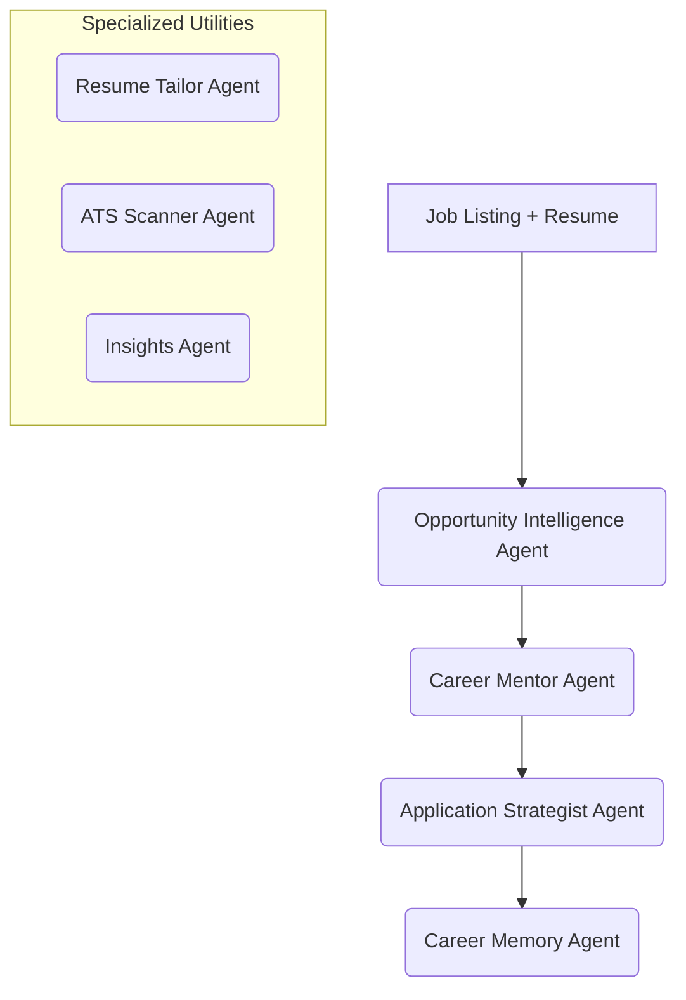

# 🚀 CareerOS: Your AI-Powered Recruiting Department & Career Assistant

CareerOS is an advanced, end-to-end job application assistant designed to automate and optimize the modern job search. By combining a **FastAPI backend**, a **React/Vite frontend**, and a multi-agent orchestration layer powered by the **Lemma platform**, CareerOS serves as a personal AI career partner.

---

## 📈 Architecture & Full Workflow (Slide Deck)

For a detailed look at the complete architecture, data flow, agent interactions, and technical design:
> [!IMPORTANT]
> **[Download / View the Complete Architecture & Workflow PPT](https://drive.google.com/file/d/1tMeKGhg54-_1sVc2h86p3E1nluMHJKdl/view?usp=sharing)**

---

## 🌟 Core Features

| Feature | Description |
| :--- | :--- |
| **🌐 Automated JobScraper** | A built-in scraping engine that aggregates real-time, active job postings directly from **17+ tier-1 company career portals** (Amazon, Google, Microsoft, Uber, Walmart, Flipkart, PayPal, Accenture, Zoho, TCS, etc.), keeping your job board freshly updated. |
| **📂 Resume Hub** | Build a master career profile and easily generate tailored versions of your resume. Utilize AI section assistance to rewrite bullets using the **STAR method**, **quantify outcomes** with business metrics, or format/resize sections. |
| **🔍 ATS Scanner & Matcher** | Scans candidate resume versions against target job descriptions, evaluates keyword density, scores overall compatibility, highlights formatting opportunities, and points out gaps. |
| **📊 Application Tracker** | A visual Kanban/list tracker to manage application statuses (Saved, Applied, Interviewing, Offer, Rejected) linked with direct event log histories. |
| **💡 AI Actionable Insights** | Generates custom career suggestions, skill-gap roadmaps, study plans, and outreach recommendations based on your master profile and active application stages. |
| **⛓️ Autonomous Workflows** | Chained workflows powered by Lemma Cloud that coordinate multiple agents asynchronously to analyze opportunities, tailor resumes, and outline custom cover letters and prep guides. |

---

## 🤖 Meet the AI Agents

CareerOS coordinates **7 specialized AI Agents** to manage different stages of your job search:



### 1. 🎯 Opportunity Intelligence Agent (`opportunity-intelligence`)
* **Role**: Evaluates the fit between your background and a target job.
* **Function**: Calculates match scores, compiles target company intelligence, estimates interview rounds, and extracts tech stack requirements.

### 2. 🧠 Career Mentor Agent (`career-mentor`)
* **Role**: Technical trainer and advisor.
* **Function**: Scans resumes for formatting opportunities, identifies critical skill gaps, and generates structured learning roadmaps and study plans.

### 3. 📝 Application Strategist Agent (`application-strategist`)
* **Role**: Outreach and positioning coach.
* **Function**: Generates customized cover letters, outlines outreach messaging (e.g. for LinkedIn/cold email), and constructs specific interview preparation guides.

### 4. 💾 Career Memory Agent (`career-memory`)
* **Role**: Profile synchronization and learning database.
* **Function**: Learns user preferences, logs completed skills, matches past application successes, and syncs history to customize upcoming recommendations.

### 5. ✂️ Resume Tailor Agent (`resume-tailor`)
* **Role**: Content optimization editor.
* **Function**: Edits bullet points using the STAR format, suggests metrics to quantify impact, and adjusts content length for precise job alignment.

### 6. 🛡️ ATS Scanner Agent (`ats-scanner`)
* **Role**: Compatibility checker.
* **Function**: Verifies resume keyword density against job descriptions to optimize indexing and parsing scores on commercial ATS software.

### 7. 🔮 Insights Agent (`insights-agent`)
* **Role**: Mission Control strategist.
* **Function**: Periodically analyzes your total application pipeline to surface actionable tasks, highlights high-value follow-ups, and flags stalling applications.

---

## 🛠️ How to Run Locally

### Prerequisites
- **Python 3.12+**
- **Node.js v18+**
- **MongoDB** (Local instance or MongoDB Atlas URL)
- **Lemma CLI** (Run `pip install lemma-terminal`)

### 1. Setup Environment
Create a `.env` file in the `backend/` directory:
```env
PORT=5002
MONGO_URI=your_mongodb_connection_string
JWT_SECRET=your_jwt_secret_key
PREFER_LEMMA=true
LEMMA_API_URL=https://api.lemma.work
LEMMA_POD_ID=your_cloud_pod_id
LEMMA_TOKEN=your_access_token
LEMMA_REFRESH_TOKEN=your_refresh_token
```

### 2. Run Backend
```bash
cd backend
python -m venv .venv
source .venv/bin/activate  # On Windows: .venv\Scripts\activate
pip install -r requirements.txt
uvicorn main:app --port 5002 --reload
```

### 3. Run Frontend
```bash
cd frontend
npm install
npm run dev
```
Open [http://localhost:3000](http://localhost:3000) to access the dashboard!
